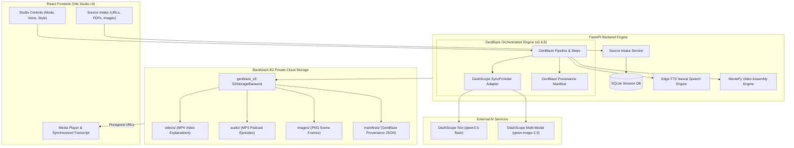

# Gen_Mind — Generative Media Studio & AI Learning Engine

> **Backblaze Generative Media Hackathon 2026 Submission**  
> Build the next generation of AI media apps. Orchestrated with GenBlaze. Stored on Backblaze B2.

[](https://github.com/backblaze-labs/genblaze)
[](https://www.backblaze.com/b2/cloud-storage.html)
[](https://python.org)
[](https://react.dev)

---

## What is Gen_Mind?

**Gen_Mind** is an AI-powered generative media studio that transforms raw source material (web pages, PDFs, Word/PPT documents, images, or text) into production-ready video explanations and multi-speaker audio podcasts:

- 🎬 **AI Video Explanations** — AI-scripted, AI-illustrated 16:9 widescreen videos with neural speech narration and multi-modal image reference context
- 🎙 **AI Podcast Audio** — Multi-speaker dialogue podcasts with real-time synchronized transcripts and click-to-seek playback
- 🖼 **Multi-Modal Source Intake** — Web URL scraping, deep-crawl sub-page discovery, PDF/DOCX/PPTX document parsing, and PNG/JPG image context ingestion
- ⚡ **GenBlaze Pipeline Architecture** — Multi-step generative workflow orchestration, custom `SyncProvider`, `Step` chaining, and native `Manifest` provenance tracking
- ☁️ **Backblaze B2 Cloud Storage** — Secure storage of all generated MP4 videos, MP3 podcasts, PNG scene frames, and provenance manifests via `genblaze_s3.S3StorageBackend`
- 🔍 **Provenance Manifests** — GenBlaze-native Manifest JSON captured for every generation and stored on Backblaze B2 for total auditability
- 💾 **Persistent Session Engine** — Knowledge context and generated media history persisted in SQLite with automatic session state recovery across page refreshes

---

## Architecture



### System Data Flow

```
[ User Sources: URLs / PDFs / Images ]
                 │
                 ▼
[ Source Intake Service ] ──► [ SQLite Session Knowledge Base ]
                 │
                 ▼
[ GenBlaze Pipeline Execution ]
   ├── Step 1: Text Scripting ──► DashScope qwen3.5-flash
   ├── Step 2: Multi-Modal Scene Synthesis ──► DashScope qwen-image-2.0 / z-image-turbo
   ├── Step 3: Neural Voice Synthesis ──► Microsoft Edge TTS
   └── Step 4: Video Compilation ──► MoviePy (16:9 MP4)
                 │
                 ▼
[ GenBlaze Manifest Provenance ] ──► Generated for every run
                 │
                 ▼
[ genblaze_s3 S3StorageBackend ] ──► Private Backblaze B2 Cloud Bucket
   ├── videos/     (MP4)
   ├── audio/      (MP3)
   ├── images/     (PNG)
   └── manifests/  (GenBlaze Manifest JSON)
```

---

## AI Providers & Models

| Provider | Type | Models Used | Role |
|---|---|---|---|
| **DashScope (Alibaba Cloud)** | Text Generation | `qwen3.5-flash` | Script writing, section outlines, summary generation |
| **DashScope (Alibaba Cloud)** | Multi-Modal & Image | `z-image-turbo`, `qwen-image-2.0` | 16:9 AI scene images & multi-image reference context |
| **Microsoft Edge TTS** | Neural Speech | `en-US-JennyNeural`, `en-US-GuyNeural`, `en-US-AriaNeural`, `en-IN-NeerjaNeural`, `en-GB-SoniaNeural`, + 3 more | Multi-speaker podcast voices & video narration |

---

## GenBlaze Pipeline & Backblaze B2 Deep-Dive

### ⚡ GenBlaze SDK Integration
Gen_Mind is built natively on top of **GenBlaze SDK v0.4.5**, utilizing its core abstractions for pipeline execution, custom provider binding, and provenance tracking:

- **`Pipeline`** — Instantiated for each workflow stage (`Pipeline("video_script_gen")`, `Pipeline("image_gen_step")`, `Pipeline("podcast_deep_mod_X")`) to run multi-step generative tasks.
- **`Step`** — Configured with modality (`Modality.TEXT`, `Modality.IMAGE`), model selection, prompt string, and step metadata (`input_images` for multi-modal reference photos).
- **`SyncProvider` (`DashScopeGenblazeProvider`)** — Custom GenBlaze provider implementation inheriting from `genblaze_core.providers.base.SyncProvider`. Handles HTTP communication with DashScope/Qwen text (`qwen3.5-flash`) and image APIs (`qwen-image-2.0`, `z-image-turbo`) without external LLM wrapper dependencies.
- **`Manifest`** — Every `Pipeline.run()` produces a GenBlaze `Manifest` object capturing run ID, canonical hash (`canonical_hash`), step execution details, model configurations, and timestamps.
- **`PipelineResult`** — Provides access to execution status, step metadata outputs (`output_text`, `img_b64`), and attached provenance manifests.
- **`genblaze_s3.S3StorageBackend`** — Official GenBlaze S3-compatible backend interface used for uploading and serving assets directly on Backblaze B2.

### ☁️ Backblaze B2 Storage Architecture
- All generated MP4 videos, MP3 podcast episodes, PNG scene frames, and provenance manifests are uploaded directly to a **private Backblaze B2 bucket**.
- **Presigned URLs**: Secure access via AWS4-HMAC-SHA256 S3 Presigned URLs (24-hour expiry) ensuring assets are never exposed publicly.
- **Organized Prefixes**:
  - `videos/` — Compiled MP4 video explanations
  - `audio/` — Master MP3 podcast episodes & individual turn audio tracks
  - `images/` — Synthesized 16:9 scene frames (PNG)
  - `manifests/` — GenBlaze provenance manifest JSON records

---

## Features & Capabilities

### 📥 Source Intake & Knowledge Base
- **URL Scraping**: Extract clean text from web pages (normal mode or deep-crawl sub-page discovery).
- **Document Ingestion**: Parse PDF, Word (.docx), and PowerPoint (.pptx) files.
- **Image Context**: Upload PNG/JPG images and screenshots to pass into multi-modal video generation.
- **Raw Text Preservation**: Preserves full un-summarized raw text context across all ingested sources for comprehensive LLM generation.
- **Instant Intake**: Scraping and intake run with 0 LLM calls for immediate processing.

### 🎬 AI Video Explanations
- **Short** (~2.5–3 min): 3 scenes, ~150 words/scene
- **Critical** (~5–7 min): 5 scenes, ~220 words/scene
- **In-Depth** (~10 min): 8 scenes, ~300 words/scene
- Each scene executes a GenBlaze `Pipeline` step synthesizing 16:9 AI images (`qwen-image-2.0` / `z-image-turbo`) combined with Edge TTS neural narration via MoviePy and stored on Backblaze B2.
- Incorporates uploaded user photos directly or via multi-modal reference prompts.

### 🎙 AI Podcast Audio
- **Short** (~3 min): 10–14 dialogue turns
- **Critical** (~5–7 min): 25–35 turns across 2 sections
- **Deep** (~20–45 min): 70–100 turns across 4 thematic modules
- Supports 1–4 speakers, 3 conversation tones (friendly, serious, deep dive), and synchronized transcript playback UI with click-to-seek.

### 🔍 Provenance Tracking
- Every generation outputs a **GenBlaze Provenance Manifest** saved as JSON on Backblaze B2 under `manifests/`.
- Manifest contains: run_id, canonical_hashes, AI providers, text/image/speech models used, GenBlaze SDK version, and timestamp.
- Accessible directly in the UI by clicking **🔍 Provenance** on any item in Media History.

### 📊 Persistent Session Engine
- Isolated studio sessions stored in SQLite (`session_db`).
- Stores source documents, full text context, and generated media outputs.
- Active session state persisted in browser storage for instant recovery across page refreshes.

---

## Setup Instructions

### 🐳 Docker Single-Command Setup (Gen Mind Container)

Build and launch the complete Gen Mind application (React frontend + FastAPI backend) in a single unified container:

```bash
# Option 1: Using Docker Compose (Recommended)
docker compose up --build

# Option 2: Using Docker CLI directly
docker build -t gen-mind .
docker run -p 8000:8000 --env-file backend/.env --name Gen_Mind gen-mind
```

Open [http://localhost:8000](http://localhost:8000) in your browser.

---

### Manual Development Setup

#### Backend Setup

```bash
cd backend

# Create virtual environment
python -m venv .venv
.venv\Scripts\activate      # Windows
# source .venv/bin/activate  # macOS/Linux

# Install dependencies
pip install -r requirements.txt

# Configure environment
cp .env.example .env
# Edit .env with your API keys

# Start server
uvicorn app.main:app --port 8000 --reload
```

#### Frontend Setup

```bash
cd frontend

# Install dependencies
npm install

# Start dev server
npm run dev
```

Open [http://localhost:5173](http://localhost:5173) in your browser.

---

## Environment Variables

| Variable | Description | Required |
|---|---|---|
| `DASHSCOPE_API_KEY` | DashScope API key for Qwen text + image models | ✅ |
| `DASHSCOPE_TEXT_MODEL` | Text model (default: `qwen3.5-flash`) | Optional |
| `DASHSCOPE_IMAGE_MODEL` | Image model (default: `z-image-turbo`) | Optional |
| `B2_KEY_ID` | Backblaze B2 Application Key ID | ✅ |
| `B2_APPLICATION_KEY` | Backblaze B2 Application Key | ✅ |
| `B2_BUCKET_NAME` | B2 bucket name | ✅ |
| `B2_ENDPOINT_URL` | B2 S3 endpoint (e.g. `https://s3.eu-central-003.backblazeb2.com`) | ✅ |
| `B2_REGION_NAME` | B2 region (e.g. `eu-central-003`) | ✅ |

---

## API Reference

| Endpoint | Method | Description |
|---|---|---|
| `/api/info` | GET | App info, providers, models, SDK details |
| `/api/storage/info` | GET | B2 storage engine status + asset counts |
| `/api/studio/generate` | POST | Generate video explanation or podcast audio from brief |
| `/api/studio/voices` | GET | List available neural speech voices |
| `/api/studio/sources/inspect` | POST | Scrape & analyze web URLs |
| `/api/studio/sources/upload` | POST | Upload PDF/DOCX/PPTX/PNG/JPG files to session |
| `/api/studio/sources/add` | POST | Add structured source entries to session |
| `/api/sessions` | GET/POST | List or create studio sessions |
| `/api/provenance/{output_id}` | GET | Get GenBlaze provenance manifest for an output |
| `/api/media/stream` | GET | Secure proxy for B2 presigned URLs |

---

## License

MIT License — see [LICENSE](LICENSE)

---

## Hackathon Submission

- **Event**: Backblaze Generative AI Media Hackathon 2026
- **GitHub**: https://github.com/Niteesh57/Gen_Mind
- **Providers**: DashScope (Qwen), Microsoft Edge TTS
- **B2 Usage**: All generated media assets and provenance manifests stored on private Backblaze B2 bucket via `genblaze-s3 S3StorageBackend`
- **GenBlaze Usage**: `Pipeline`, `Step`, `SyncProvider`, `Manifest`, `PipelineResult`, `genblaze_s3.S3StorageBackend`
